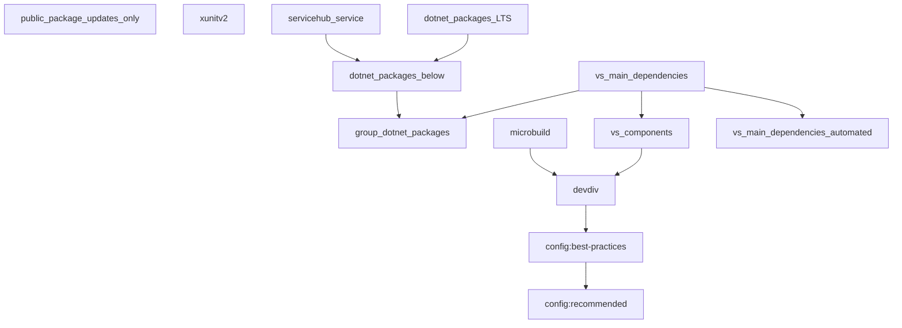

# vs-renovate-presets

This repo houses renovate presets that are shared across our repos.
It is not intended for consumption outside Microsoft 1st party repos.

## Preset graph

The following graph depicts the presets we have and their relationships.



Extending a preset in your renovate.json file implicitly extends all the presets it points to in the graph.
So for example, extending the `microbuild` preset means you are also extending `devdiv` and `config:recommended`.

A preset in this repo can be consumed in your own repo's renovate.json file by adding an `extends` string starting with `github>microsoft/vs-renovate-presets:` and ending with the filename of the preset.
The `.json` file extension from the preset is optional.

## Recommended starting point

A good starting point renovate.json file for Visual Studio components built with Microbuild is below:

```json
{
    "$schema": "https://docs.renovatebot.com/renovate-schema.json",
    "extends": [
        "github>microsoft/vs-renovate-presets:microbuild",
        "github>microsoft/vs-renovate-presets:vs_main_dependencies"
    ],
    "packageRules": []
}
```

## Contributing

This project welcomes contributions and suggestions.  Most contributions require you to agree to a
Contributor License Agreement (CLA) declaring that you have the right to, and actually do, grant us
the rights to use your contribution. For details, visit https://cla.opensource.microsoft.com.

When you submit a pull request, a CLA bot will automatically determine whether you need to provide
a CLA and decorate the PR appropriately (e.g., status check, comment). Simply follow the instructions
provided by the bot. You will only need to do this once across all repos using our CLA.

This project has adopted the [Microsoft Open Source Code of Conduct](https://opensource.microsoft.com/codeofconduct/).
For more information see the [Code of Conduct FAQ](https://opensource.microsoft.com/codeofconduct/faq/) or
contact [opencode@microsoft.com](mailto:opencode@microsoft.com) with any additional questions or comments.

## Trademarks

This project may contain trademarks or logos for projects, products, or services. Authorized use of Microsoft
trademarks or logos is subject to and must follow
[Microsoft's Trademark & Brand Guidelines](https://www.microsoft.com/legal/intellectualproperty/trademarks/usage/general).
Use of Microsoft trademarks or logos in modified versions of this project must not cause confusion or imply Microsoft sponsorship.
Any use of third-party trademarks or logos are subject to those third-party's policies.
